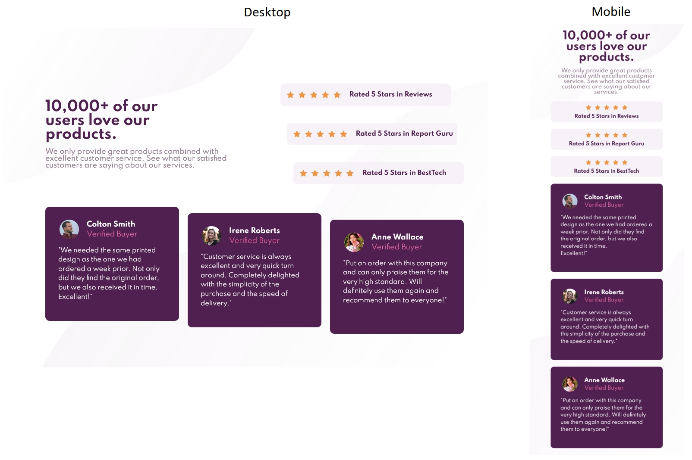

# Frontend Mentor - Social proof section solution

This is a solution to the [Social proof section challenge on Frontend Mentor](https://www.frontendmentor.io/challenges/social-proof-section-6e0qTv_bA). Frontend Mentor challenges help you improve your coding skills by building realistic projects. 

## Table of contents

- [Overview](#overview)
  - [The challenge](#the-challenge)
  - [Screenshot](#screenshot)
- [My process](#my-process)
  - [Built with](#built-with)
  - [What I learned](#what-i-learned)
  - [Continued development](#continued-development)
  - [Useful resources](#useful-resources)
- [Author](#author)

## Overview

### The challenge

Users should be able to:

- View the optimal layout depending on their device's screen size
- See hover states for interactive elements (if there are any)

### Screenshot

## My process

### Built with

- HTML5 and CSS (grid mainly)
- Visual Studio Code software

### What I learned

Grid templates are very easy to use when it comes to offsetting elements and still aligning them ar the edges of the page

### Continued development

One of the bigger challenges not only on this one, but also on all previous projects is to keep things organised and avoid ending up with a ton of classes and id's.

### Useful resources

- (https://www.w3schools.com) - My main goto when I need to remember certain things in html and css.

## Author

- Frontend Mentor - [@ignasc](https://www.frontendmentor.io/profile/ignasc)
- Github - [@ignasc](https://github.com/ignasc)
- Twitter - [@Ignasc](https://twitter.com/Ignasc)
- Instagram - [@ignas.c](https://www.instagram.com/ignas.c/)